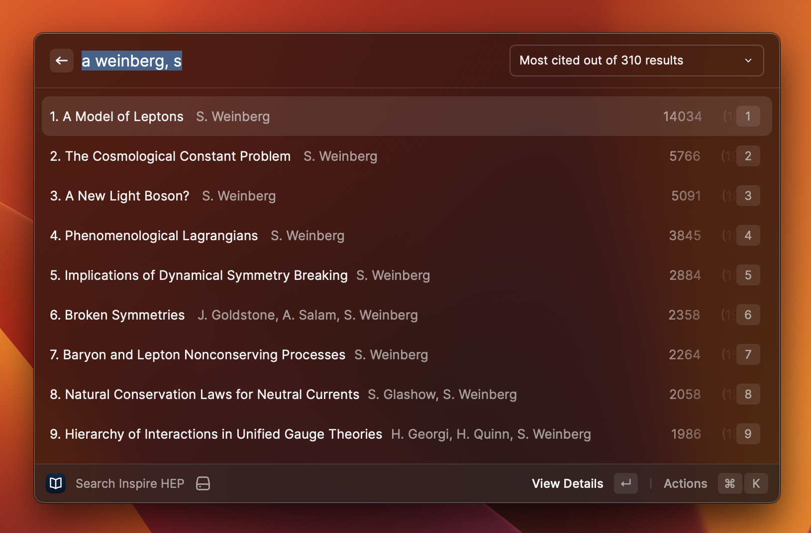
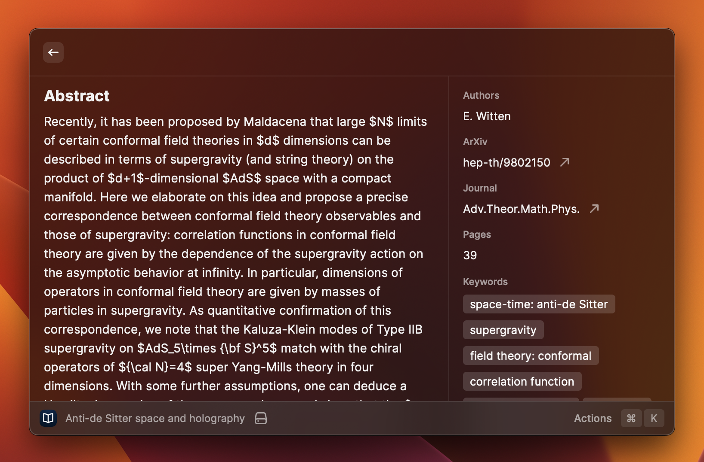

# Inspire-Search Extension for Raycast

Search papers on inspirehep.net and browse results from . 

## Actions

Actions include:

-  **View Details:** show more details such as abstract, book description, journal, number of pages, and keywords.
-  **Open in Browser:** when available, download the preprint from  in pdf format. 

In the details view, hover on the authors to the see the complete list